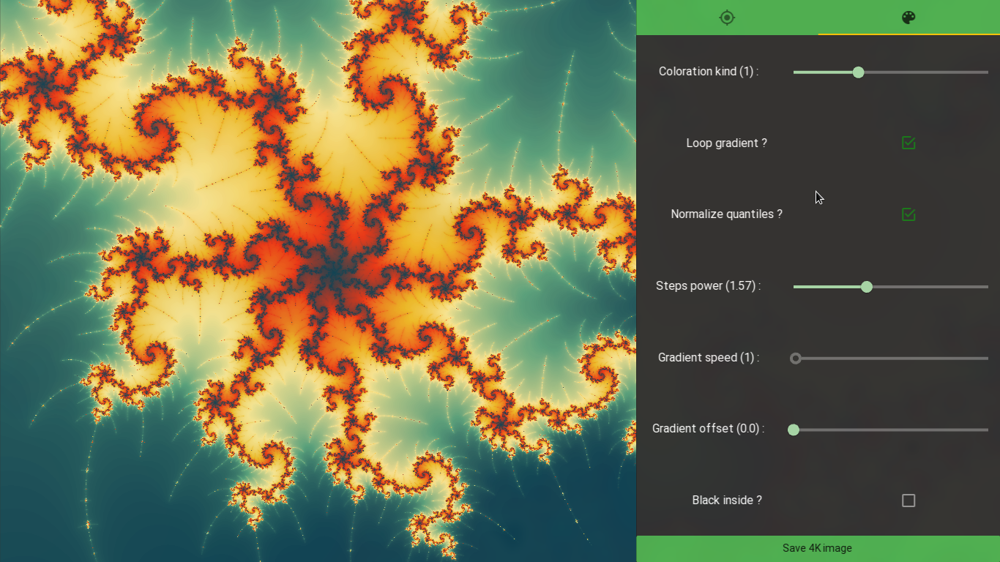

# Brocoli

Mandelbrot set explorer and generator written in [python](python.org) and [kivy](kivy.org).

### Features

Brocoli has many components:
 - a graphical interface to design and compute 
 the Mandelbrot or Julia set
 - a command line interface to set all the implemented parameters
 - it can generate random views of the Mandelbrot set
 - and a Twitter bot to post random fractals

### Installation and usage

You will need python 3.6+ to install and run Brocoli, 
but you can install it with or without the GUI. 

###### Download
First clone the repository via ssh

    git clone git@gitlab.com:ddorn/brocoli.git
    
Or via https :

    git clone https://gitlab.com/ddorn/brocoli.git

###### Install
Top install it without the GUI, run :

    pip install -U ./brocoli

But to run the graphical interface written with kivy
you need to install it this way:

    pip install -U "./brocoli[gui]"
    
*Note: to install brocoli from inside the folder, run*
*`pip install -U .` or `pip install -U ".[gui]"`*. 

###### Run
When you install brocoli with pip it installs a `brocoli`
script in that you can just run anywhere. I it a well behaved
unix tool so it accepts `-` for `stdin` or `stdout` and you 
can see all the options with

    brocoli --help
    brocoli gen --help
    
Try to run `brocoli random` !

To start the graphical insterface, just use

    brocoli gui

### Thanks

First of all, thanks to Benoit Mandelbrot for revealing
beauty od fractals to the world and then to Gaston Julia and Pierre Fatou
for their discovery of the Mandelbrot set.
Thanks also to Numpy and [Numba](https://github.com/numba/numba)
that compiles (JIT) the python code to compute the Mandelbrot set and
make it run two orders of magnitude faster.
Big thanks to [Kivy](kivy.org) and [KivyMD](github.com/HeaTTheatR/KivyMD).
I would not be able to create a graphical interface this nice in such a
short time without them.
